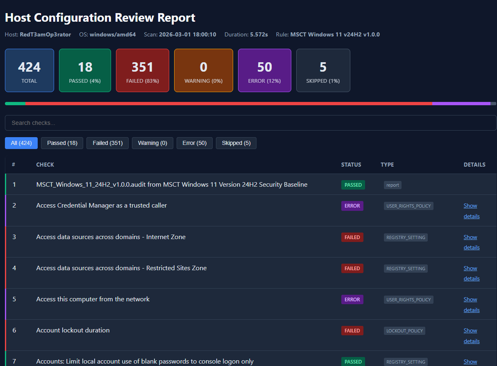

# Host-Config-Review-Scanner

A Go-based engine that parses Tenable Nessus `.audit` rule files and runs local host configuration review scans on **Windows** and **Linux**. Results are rendered as a self-contained HTML report. Allow automatic scan for host or image configuration hardening when your host doesn't have access to Nessus.
(It is a vibe code project)



## Features

- Full `.audit` file parser supporting structural tags (`<check_type>`, `<if>`, `<condition>`, `<then>`, `<else>`, `<group_policy>`), metadata extraction, variable substitution, and multi-line quoted values
- Conditional logic evaluation (AND/OR conditions, `auto:"FAILED"` semantics, nested if blocks)
- Platform-aware check dispatching via build tags

### Linux Check Types

| Type | Method |
|------|--------|
| `CMD_EXEC` | Runs shell commands via `/bin/bash -c`, matches stdout against `expect` regex |
| `FILE_CONTENT_CHECK` | Scans file lines for regex match + expected value |
| `FILE_CONTENT_CHECK_NOT` | Passes if **no** file line matches the pattern |

### Windows Check Types

| Type | Method |
|------|--------|
| `REGISTRY_SETTING` | Reads registry values (DWORD, string, regex, CAN_NOT_BE_NULL) |
| `USER_RIGHTS_POLICY` | Queries Local Security Authority (LSA) API |
| `WMI_POLICY` | Executes WQL queries via COM/OLE |
| `AUDIT_POLICY_SUBCATEGORY` | Runs `auditpol.exe /get` and compares settings |
| `LOCKOUT_POLICY` | Parses `net accounts` output |
| `PASSWORD_POLICY` | Parses `net accounts` output |
| `BANNER_CHECK` | Reads legal notice registry values |
| `ANONYMOUS_SID_SETTING` | Reads `RestrictAnonymousSAM` registry value |


Self-contained single-file report with:
- Summary cards (pass / fail / warning / error / skip counts and percentages)
- Filter buttons and search box

## Prerequisites

- **Go 1.22+** (tested with 1.24)
- `.audit` rule files (obtain separately from Tenable or your compliance framework). You can download official Windows or Linux audit packs from Tenable at https://www.tenable.com/audits.

## Build

```bash
# Windows
go build -o scanner.exe ./cmd/scanner

# Linux
GOOS=linux GOARCH=amd64 go build -o scanner ./cmd/scanner
```

Cross-compile from Windows for Linux:

```powershell
$env:GOOS="linux"; $env:GOARCH="amd64"; go build -o scanner ./cmd/scanner; $env:GOOS="windows"
```

## Usage

```bash
# Scan with a CIS Debian audit file (run as root on the target host)
sudo ./scanner -rule CIS_Debian_Linux_13_v1.0.0_L2_Server.audit -output report.html

# Scan with a Windows Server audit file (run as Administrator)
scanner.exe -rule MSCT_Windows_Server_2022_MS_v1.0.0.audit -output report.html

# Verbose mode (prints each check result to stdout)
scanner.exe -rule rules.audit -output report.html -verbose
```

### Flags

| Flag | Default | Description |
|------|---------|-------------|
| `-rule` | *(required)* | Path to the `.audit` rule file |
| `-output` | `report.html` | Output HTML report path |
| `-verbose` | `false` | Print each check result to stdout |
| `-force`   | `false` | Bypass condition/version checks and run all checks regardless of OS/version guards |

## Project Structure

```
cmd/scanner/main.go              CLI entry point
internal/parser/types.go         AST type definitions
internal/parser/parser.go        Tokenizer & recursive descent parser
internal/parser/parser_test.go   Parser unit tests
internal/checks/interface.go     Checker interface & dispatch
internal/checks/helpers.go       Shared comparison utilities
internal/checks/unsupported.go   Stub for unsupported platform checks
internal/checks/dispatch_linux.go
internal/checks/dispatch_windows.go
internal/checks/cmd_exec_linux.go
internal/checks/file_content_linux.go
internal/checks/registry_windows.go
internal/checks/user_rights_windows.go
internal/checks/wmi_windows.go
internal/checks/audit_policy_windows.go
internal/checks/policy_windows.go
internal/executor/executor.go    AST walker & condition evaluator
internal/report/html.go          HTML report generator
```

## Testing

```bash
go test ./... -v
```

